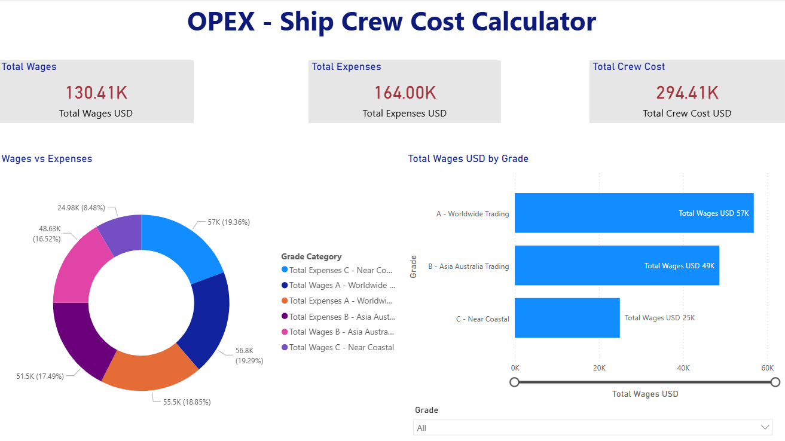

# OPEX - Ship Crew Cost Calculator Dashboard

Dashboard Power BI untuk analisis biaya operasional kru kapal.

## Tools
- Power BI Desktop
- Microsoft Excel
- DAX

## Dashboard Features
- Overview (Total Wages, Total Expenses, Total Crew Cost, Wages vs Expenses, and Total Wages USD by Grade )
- Wages Detail (Wages by Rank, Total Wages by Rank and Grade, Allowance by Rank and Vessel Type)
- Expenses Detail (Expenses Sub Item, Expenses by Vessel Type, Total Expenses by Description and Proportion of Expenses)
- Crew Basis (Wages by Grade and Comparison of Wages 3 Grade)

## Preview

